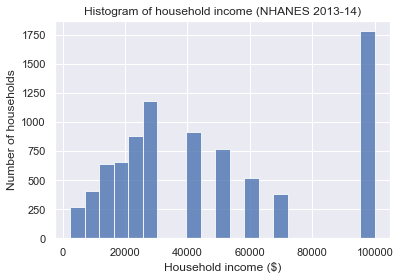
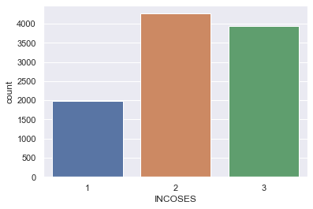
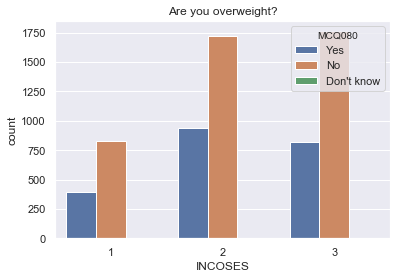
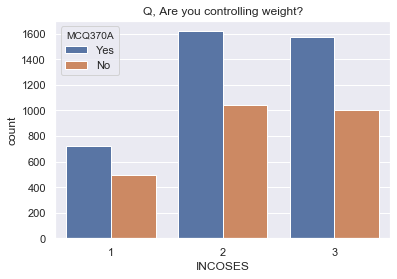
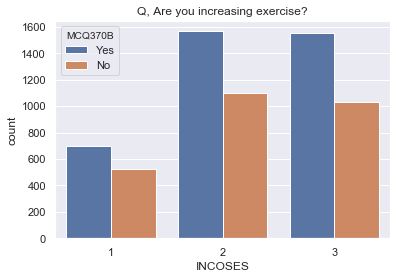
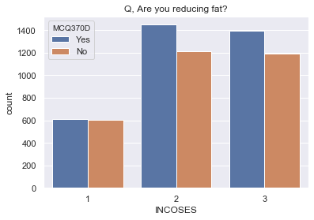
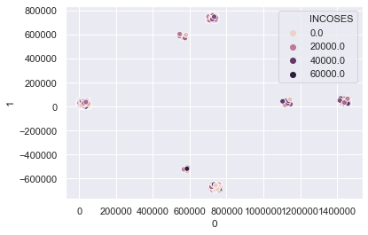
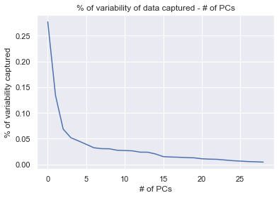
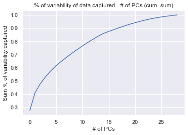

# EDA of NHANES 2013-2014 database

## 0. Importing necessary modules


```python
import numpy as np
import pandas as pd
import matplotlib.pyplot as plt
import seaborn as sns
sns.set()
```

## 1. Importing CSV Files


```python
demo = pd.read_csv("data/demographic.csv")
exam = pd.read_csv("data/examination.csv")
diet = pd.read_csv("data/diet.csv")
# medi = pd.read_csv("data/medications.csv")
ques = pd.read_csv("data/questionnaire.csv")
```


```python
display(demo.head())
display(exam.head())
display(diet.head())
display(ques.head())
```


<div>
<style scoped>
    .dataframe tbody tr th:only-of-type {
        vertical-align: middle;
    }

    .dataframe tbody tr th {
        vertical-align: top;
    }

    .dataframe thead th {
        text-align: right;
    }
</style>
<table border="1" class="dataframe">
  <thead>
    <tr style="text-align: right;">
      <th></th>
      <th>SEQN</th>
      <th>SDDSRVYR</th>
      <th>RIDSTATR</th>
      <th>RIAGENDR</th>
      <th>RIDAGEYR</th>
      <th>RIDAGEMN</th>
      <th>RIDRETH1</th>
      <th>RIDRETH3</th>
      <th>RIDEXMON</th>
      <th>RIDEXAGM</th>
      <th>...</th>
      <th>DMDHREDU</th>
      <th>DMDHRMAR</th>
      <th>DMDHSEDU</th>
      <th>WTINT2YR</th>
      <th>WTMEC2YR</th>
      <th>SDMVPSU</th>
      <th>SDMVSTRA</th>
      <th>INDHHIN2</th>
      <th>INDFMIN2</th>
      <th>INDFMPIR</th>
    </tr>
  </thead>
  <tbody>
    <tr>
      <th>0</th>
      <td>73557</td>
      <td>8</td>
      <td>2</td>
      <td>1</td>
      <td>69</td>
      <td>NaN</td>
      <td>4</td>
      <td>4</td>
      <td>1.0</td>
      <td>NaN</td>
      <td>...</td>
      <td>3.0</td>
      <td>4.0</td>
      <td>NaN</td>
      <td>13281.237386</td>
      <td>13481.042095</td>
      <td>1</td>
      <td>112</td>
      <td>4.0</td>
      <td>4.0</td>
      <td>0.84</td>
    </tr>
    <tr>
      <th>1</th>
      <td>73558</td>
      <td>8</td>
      <td>2</td>
      <td>1</td>
      <td>54</td>
      <td>NaN</td>
      <td>3</td>
      <td>3</td>
      <td>1.0</td>
      <td>NaN</td>
      <td>...</td>
      <td>3.0</td>
      <td>1.0</td>
      <td>1.0</td>
      <td>23682.057386</td>
      <td>24471.769625</td>
      <td>1</td>
      <td>108</td>
      <td>7.0</td>
      <td>7.0</td>
      <td>1.78</td>
    </tr>
    <tr>
      <th>2</th>
      <td>73559</td>
      <td>8</td>
      <td>2</td>
      <td>1</td>
      <td>72</td>
      <td>NaN</td>
      <td>3</td>
      <td>3</td>
      <td>2.0</td>
      <td>NaN</td>
      <td>...</td>
      <td>4.0</td>
      <td>1.0</td>
      <td>3.0</td>
      <td>57214.803319</td>
      <td>57193.285376</td>
      <td>1</td>
      <td>109</td>
      <td>10.0</td>
      <td>10.0</td>
      <td>4.51</td>
    </tr>
    <tr>
      <th>3</th>
      <td>73560</td>
      <td>8</td>
      <td>2</td>
      <td>1</td>
      <td>9</td>
      <td>NaN</td>
      <td>3</td>
      <td>3</td>
      <td>1.0</td>
      <td>119.0</td>
      <td>...</td>
      <td>3.0</td>
      <td>1.0</td>
      <td>4.0</td>
      <td>55201.178592</td>
      <td>55766.512438</td>
      <td>2</td>
      <td>109</td>
      <td>9.0</td>
      <td>9.0</td>
      <td>2.52</td>
    </tr>
    <tr>
      <th>4</th>
      <td>73561</td>
      <td>8</td>
      <td>2</td>
      <td>2</td>
      <td>73</td>
      <td>NaN</td>
      <td>3</td>
      <td>3</td>
      <td>1.0</td>
      <td>NaN</td>
      <td>...</td>
      <td>5.0</td>
      <td>1.0</td>
      <td>5.0</td>
      <td>63709.667069</td>
      <td>65541.871229</td>
      <td>2</td>
      <td>116</td>
      <td>15.0</td>
      <td>15.0</td>
      <td>5.00</td>
    </tr>
  </tbody>
</table>
<p>5 rows × 47 columns</p>
</div>


<div>
<style scoped>
    .dataframe tbody tr th:only-of-type {
        vertical-align: middle;
    }

    .dataframe tbody tr th {
        vertical-align: top;
    }

    .dataframe thead th {
        text-align: right;
    }
</style>
<table border="1" class="dataframe">
  <thead>
    <tr style="text-align: right;">
      <th></th>
      <th>SEQN</th>
      <th>PEASCST1</th>
      <th>PEASCTM1</th>
      <th>PEASCCT1</th>
      <th>BPXCHR</th>
      <th>BPAARM</th>
      <th>BPACSZ</th>
      <th>BPXPLS</th>
      <th>BPXPULS</th>
      <th>BPXPTY</th>
      <th>...</th>
      <th>CSXLEAOD</th>
      <th>CSXSOAOD</th>
      <th>CSXGRAOD</th>
      <th>CSXONOD</th>
      <th>CSXNGSOD</th>
      <th>CSXSLTRT</th>
      <th>CSXSLTRG</th>
      <th>CSXNART</th>
      <th>CSXNARG</th>
      <th>CSAEFFRT</th>
    </tr>
  </thead>
  <tbody>
    <tr>
      <th>0</th>
      <td>73557</td>
      <td>1</td>
      <td>620.0</td>
      <td>NaN</td>
      <td>NaN</td>
      <td>1.0</td>
      <td>4.0</td>
      <td>86.0</td>
      <td>1.0</td>
      <td>1.0</td>
      <td>...</td>
      <td>2.0</td>
      <td>1.0</td>
      <td>1.0</td>
      <td>1.0</td>
      <td>4.0</td>
      <td>62.0</td>
      <td>1.0</td>
      <td>NaN</td>
      <td>NaN</td>
      <td>1.0</td>
    </tr>
    <tr>
      <th>1</th>
      <td>73558</td>
      <td>1</td>
      <td>766.0</td>
      <td>NaN</td>
      <td>NaN</td>
      <td>1.0</td>
      <td>4.0</td>
      <td>74.0</td>
      <td>1.0</td>
      <td>1.0</td>
      <td>...</td>
      <td>3.0</td>
      <td>1.0</td>
      <td>2.0</td>
      <td>3.0</td>
      <td>4.0</td>
      <td>28.0</td>
      <td>1.0</td>
      <td>NaN</td>
      <td>NaN</td>
      <td>1.0</td>
    </tr>
    <tr>
      <th>2</th>
      <td>73559</td>
      <td>1</td>
      <td>665.0</td>
      <td>NaN</td>
      <td>NaN</td>
      <td>1.0</td>
      <td>4.0</td>
      <td>68.0</td>
      <td>1.0</td>
      <td>1.0</td>
      <td>...</td>
      <td>2.0</td>
      <td>1.0</td>
      <td>2.0</td>
      <td>3.0</td>
      <td>4.0</td>
      <td>49.0</td>
      <td>1.0</td>
      <td>NaN</td>
      <td>NaN</td>
      <td>3.0</td>
    </tr>
    <tr>
      <th>3</th>
      <td>73560</td>
      <td>1</td>
      <td>803.0</td>
      <td>NaN</td>
      <td>NaN</td>
      <td>1.0</td>
      <td>2.0</td>
      <td>64.0</td>
      <td>1.0</td>
      <td>1.0</td>
      <td>...</td>
      <td>NaN</td>
      <td>NaN</td>
      <td>NaN</td>
      <td>NaN</td>
      <td>NaN</td>
      <td>NaN</td>
      <td>NaN</td>
      <td>NaN</td>
      <td>NaN</td>
      <td>NaN</td>
    </tr>
    <tr>
      <th>4</th>
      <td>73561</td>
      <td>1</td>
      <td>949.0</td>
      <td>NaN</td>
      <td>NaN</td>
      <td>1.0</td>
      <td>3.0</td>
      <td>92.0</td>
      <td>1.0</td>
      <td>1.0</td>
      <td>...</td>
      <td>3.0</td>
      <td>1.0</td>
      <td>4.0</td>
      <td>3.0</td>
      <td>4.0</td>
      <td>NaN</td>
      <td>NaN</td>
      <td>NaN</td>
      <td>NaN</td>
      <td>1.0</td>
    </tr>
  </tbody>
</table>
<p>5 rows × 224 columns</p>
</div>


<div>
<style scoped>
    .dataframe tbody tr th:only-of-type {
        vertical-align: middle;
    }

    .dataframe tbody tr th {
        vertical-align: top;
    }

    .dataframe thead th {
        text-align: right;
    }
</style>
<table border="1" class="dataframe">
  <thead>
    <tr style="text-align: right;">
      <th></th>
      <th>SEQN</th>
      <th>WTDRD1</th>
      <th>WTDR2D</th>
      <th>DR1DRSTZ</th>
      <th>DR1EXMER</th>
      <th>DRABF</th>
      <th>DRDINT</th>
      <th>DR1DBIH</th>
      <th>DR1DAY</th>
      <th>DR1LANG</th>
      <th>...</th>
      <th>DRD370QQ</th>
      <th>DRD370R</th>
      <th>DRD370RQ</th>
      <th>DRD370S</th>
      <th>DRD370SQ</th>
      <th>DRD370T</th>
      <th>DRD370TQ</th>
      <th>DRD370U</th>
      <th>DRD370UQ</th>
      <th>DRD370V</th>
    </tr>
  </thead>
  <tbody>
    <tr>
      <th>0</th>
      <td>73557</td>
      <td>16888.327864</td>
      <td>12930.890649</td>
      <td>1</td>
      <td>49.0</td>
      <td>2.0</td>
      <td>2.0</td>
      <td>6.0</td>
      <td>2.0</td>
      <td>1.0</td>
      <td>...</td>
      <td>NaN</td>
      <td>NaN</td>
      <td>NaN</td>
      <td>NaN</td>
      <td>NaN</td>
      <td>NaN</td>
      <td>NaN</td>
      <td>NaN</td>
      <td>NaN</td>
      <td>NaN</td>
    </tr>
    <tr>
      <th>1</th>
      <td>73558</td>
      <td>17932.143865</td>
      <td>12684.148869</td>
      <td>1</td>
      <td>59.0</td>
      <td>2.0</td>
      <td>2.0</td>
      <td>4.0</td>
      <td>1.0</td>
      <td>1.0</td>
      <td>...</td>
      <td>NaN</td>
      <td>2.0</td>
      <td>NaN</td>
      <td>2.0</td>
      <td>NaN</td>
      <td>2.0</td>
      <td>NaN</td>
      <td>2.0</td>
      <td>NaN</td>
      <td>2.0</td>
    </tr>
    <tr>
      <th>2</th>
      <td>73559</td>
      <td>59641.812930</td>
      <td>39394.236709</td>
      <td>1</td>
      <td>49.0</td>
      <td>2.0</td>
      <td>2.0</td>
      <td>18.0</td>
      <td>6.0</td>
      <td>1.0</td>
      <td>...</td>
      <td>NaN</td>
      <td>NaN</td>
      <td>NaN</td>
      <td>NaN</td>
      <td>NaN</td>
      <td>NaN</td>
      <td>NaN</td>
      <td>NaN</td>
      <td>NaN</td>
      <td>NaN</td>
    </tr>
    <tr>
      <th>3</th>
      <td>73560</td>
      <td>142203.069917</td>
      <td>125966.366442</td>
      <td>1</td>
      <td>54.0</td>
      <td>2.0</td>
      <td>2.0</td>
      <td>21.0</td>
      <td>3.0</td>
      <td>1.0</td>
      <td>...</td>
      <td>NaN</td>
      <td>NaN</td>
      <td>NaN</td>
      <td>NaN</td>
      <td>NaN</td>
      <td>NaN</td>
      <td>NaN</td>
      <td>NaN</td>
      <td>NaN</td>
      <td>NaN</td>
    </tr>
    <tr>
      <th>4</th>
      <td>73561</td>
      <td>59052.357033</td>
      <td>39004.892993</td>
      <td>1</td>
      <td>63.0</td>
      <td>2.0</td>
      <td>2.0</td>
      <td>18.0</td>
      <td>1.0</td>
      <td>1.0</td>
      <td>...</td>
      <td>NaN</td>
      <td>2.0</td>
      <td>NaN</td>
      <td>2.0</td>
      <td>NaN</td>
      <td>2.0</td>
      <td>NaN</td>
      <td>2.0</td>
      <td>NaN</td>
      <td>2.0</td>
    </tr>
  </tbody>
</table>
<p>5 rows × 168 columns</p>
</div>


<div>
<style scoped>
    .dataframe tbody tr th:only-of-type {
        vertical-align: middle;
    }

    .dataframe tbody tr th {
        vertical-align: top;
    }

    .dataframe thead th {
        text-align: right;
    }
</style>
<table border="1" class="dataframe">
  <thead>
    <tr style="text-align: right;">
      <th></th>
      <th>SEQN</th>
      <th>ACD011A</th>
      <th>ACD011B</th>
      <th>ACD011C</th>
      <th>ACD040</th>
      <th>ACD110</th>
      <th>ALQ101</th>
      <th>ALQ110</th>
      <th>ALQ120Q</th>
      <th>ALQ120U</th>
      <th>...</th>
      <th>WHD080U</th>
      <th>WHD080L</th>
      <th>WHD110</th>
      <th>WHD120</th>
      <th>WHD130</th>
      <th>WHD140</th>
      <th>WHQ150</th>
      <th>WHQ030M</th>
      <th>WHQ500</th>
      <th>WHQ520</th>
    </tr>
  </thead>
  <tbody>
    <tr>
      <th>0</th>
      <td>73557</td>
      <td>1.0</td>
      <td>NaN</td>
      <td>NaN</td>
      <td>NaN</td>
      <td>NaN</td>
      <td>1.0</td>
      <td>NaN</td>
      <td>1.0</td>
      <td>3.0</td>
      <td>...</td>
      <td>NaN</td>
      <td>40.0</td>
      <td>270.0</td>
      <td>200.0</td>
      <td>69.0</td>
      <td>270.0</td>
      <td>62.0</td>
      <td>NaN</td>
      <td>NaN</td>
      <td>NaN</td>
    </tr>
    <tr>
      <th>1</th>
      <td>73558</td>
      <td>1.0</td>
      <td>NaN</td>
      <td>NaN</td>
      <td>NaN</td>
      <td>NaN</td>
      <td>1.0</td>
      <td>NaN</td>
      <td>7.0</td>
      <td>1.0</td>
      <td>...</td>
      <td>NaN</td>
      <td>NaN</td>
      <td>240.0</td>
      <td>250.0</td>
      <td>72.0</td>
      <td>250.0</td>
      <td>25.0</td>
      <td>NaN</td>
      <td>NaN</td>
      <td>NaN</td>
    </tr>
    <tr>
      <th>2</th>
      <td>73559</td>
      <td>1.0</td>
      <td>NaN</td>
      <td>NaN</td>
      <td>NaN</td>
      <td>NaN</td>
      <td>1.0</td>
      <td>NaN</td>
      <td>0.0</td>
      <td>NaN</td>
      <td>...</td>
      <td>NaN</td>
      <td>NaN</td>
      <td>180.0</td>
      <td>190.0</td>
      <td>70.0</td>
      <td>228.0</td>
      <td>35.0</td>
      <td>NaN</td>
      <td>NaN</td>
      <td>NaN</td>
    </tr>
    <tr>
      <th>3</th>
      <td>73560</td>
      <td>1.0</td>
      <td>NaN</td>
      <td>NaN</td>
      <td>NaN</td>
      <td>NaN</td>
      <td>NaN</td>
      <td>NaN</td>
      <td>NaN</td>
      <td>NaN</td>
      <td>...</td>
      <td>NaN</td>
      <td>NaN</td>
      <td>NaN</td>
      <td>NaN</td>
      <td>NaN</td>
      <td>NaN</td>
      <td>NaN</td>
      <td>3.0</td>
      <td>3.0</td>
      <td>3.0</td>
    </tr>
    <tr>
      <th>4</th>
      <td>73561</td>
      <td>1.0</td>
      <td>NaN</td>
      <td>NaN</td>
      <td>NaN</td>
      <td>NaN</td>
      <td>1.0</td>
      <td>NaN</td>
      <td>0.0</td>
      <td>NaN</td>
      <td>...</td>
      <td>NaN</td>
      <td>NaN</td>
      <td>150.0</td>
      <td>135.0</td>
      <td>67.0</td>
      <td>170.0</td>
      <td>60.0</td>
      <td>NaN</td>
      <td>NaN</td>
      <td>NaN</td>
    </tr>
  </tbody>
</table>
<p>5 rows × 953 columns</p>
</div>


# 2. Defining social groups based on income


```python
income_bins = demo[(demo["INDHHIN2"] <= 10) | (demo["INDHHIN2"] == 15)]["INDHHIN2"]

bin2bill = {1: 2500, 2: 7500, 3: 12500, 4: 17500, 5: 22500,
            6: 30000, 7: 40000, 8: 50000, 9: 60000, 10: 70000, 15: 100000}
income = income_bins.replace(bin2bill)
sns.distplot(income, kde=False, hist=True, hist_kws=dict(alpha=0.8))
plt.xlabel("Household income ($)")
plt.ylabel("Number of households")
plt.title("Histogram of household income (NHANES 2013-14)")
plt.savefig("simple_hist.png")
```





[Pew defines](https://www.pewsocialtrends.org/2015/12/09/the-american-middle-class-is-losing-ground/) the middle class as those earning between two-thirds and double the median household income. This Pew classification means that the category of middle-income is made up of people making somewhere between $\$40,500$ and $\$122,000$.

```
income.median()
> 30000.0
```

Note that in this dataset, the median is at $\$30000$ (because the data is binned). Here for simplicity, we categorize into 3 categories as:
- Higher income: >=$\$65000$
- Middle income: $\$20000$~$65000$

- Lower income: <$\$20000$

We will call the categories as income-based SESs.

# 3. Differences and disparities among income-based SESs
Our main objective is to find out whether social inequity leads to difference in health risk.

First, let us join the `demo` dataframe and `ques` dataframe.


```python
dequ = demo.merge(ques)
dequ.head()
```


<div>
<style scoped>
    .dataframe tbody tr th:only-of-type {
        vertical-align: middle;
    }

    .dataframe tbody tr th {
        vertical-align: top;
    }

    .dataframe thead th {
        text-align: right;
    }
</style>
<table border="1" class="dataframe">
  <thead>
    <tr style="text-align: right;">
      <th></th>
      <th>SEQN</th>
      <th>SDDSRVYR</th>
      <th>RIDSTATR</th>
      <th>RIAGENDR</th>
      <th>RIDAGEYR</th>
      <th>RIDAGEMN</th>
      <th>RIDRETH1</th>
      <th>RIDRETH3</th>
      <th>RIDEXMON</th>
      <th>RIDEXAGM</th>
      <th>...</th>
      <th>WHD080U</th>
      <th>WHD080L</th>
      <th>WHD110</th>
      <th>WHD120</th>
      <th>WHD130</th>
      <th>WHD140</th>
      <th>WHQ150</th>
      <th>WHQ030M</th>
      <th>WHQ500</th>
      <th>WHQ520</th>
    </tr>
  </thead>
  <tbody>
    <tr>
      <th>0</th>
      <td>73557</td>
      <td>8</td>
      <td>2</td>
      <td>1</td>
      <td>69</td>
      <td>NaN</td>
      <td>4</td>
      <td>4</td>
      <td>1.0</td>
      <td>NaN</td>
      <td>...</td>
      <td>NaN</td>
      <td>40.0</td>
      <td>270.0</td>
      <td>200.0</td>
      <td>69.0</td>
      <td>270.0</td>
      <td>62.0</td>
      <td>NaN</td>
      <td>NaN</td>
      <td>NaN</td>
    </tr>
    <tr>
      <th>1</th>
      <td>73558</td>
      <td>8</td>
      <td>2</td>
      <td>1</td>
      <td>54</td>
      <td>NaN</td>
      <td>3</td>
      <td>3</td>
      <td>1.0</td>
      <td>NaN</td>
      <td>...</td>
      <td>NaN</td>
      <td>NaN</td>
      <td>240.0</td>
      <td>250.0</td>
      <td>72.0</td>
      <td>250.0</td>
      <td>25.0</td>
      <td>NaN</td>
      <td>NaN</td>
      <td>NaN</td>
    </tr>
    <tr>
      <th>2</th>
      <td>73559</td>
      <td>8</td>
      <td>2</td>
      <td>1</td>
      <td>72</td>
      <td>NaN</td>
      <td>3</td>
      <td>3</td>
      <td>2.0</td>
      <td>NaN</td>
      <td>...</td>
      <td>NaN</td>
      <td>NaN</td>
      <td>180.0</td>
      <td>190.0</td>
      <td>70.0</td>
      <td>228.0</td>
      <td>35.0</td>
      <td>NaN</td>
      <td>NaN</td>
      <td>NaN</td>
    </tr>
    <tr>
      <th>3</th>
      <td>73560</td>
      <td>8</td>
      <td>2</td>
      <td>1</td>
      <td>9</td>
      <td>NaN</td>
      <td>3</td>
      <td>3</td>
      <td>1.0</td>
      <td>119.0</td>
      <td>...</td>
      <td>NaN</td>
      <td>NaN</td>
      <td>NaN</td>
      <td>NaN</td>
      <td>NaN</td>
      <td>NaN</td>
      <td>NaN</td>
      <td>3.0</td>
      <td>3.0</td>
      <td>3.0</td>
    </tr>
    <tr>
      <th>4</th>
      <td>73561</td>
      <td>8</td>
      <td>2</td>
      <td>2</td>
      <td>73</td>
      <td>NaN</td>
      <td>3</td>
      <td>3</td>
      <td>1.0</td>
      <td>NaN</td>
      <td>...</td>
      <td>NaN</td>
      <td>NaN</td>
      <td>150.0</td>
      <td>135.0</td>
      <td>67.0</td>
      <td>170.0</td>
      <td>60.0</td>
      <td>NaN</td>
      <td>NaN</td>
      <td>NaN</td>
    </tr>
  </tbody>
</table>
<p>5 rows × 999 columns</p>
</div>


We will put the categorized income status into a new column named `INCOBIN`.


```python
dequ["INCOSES"] = dequ["INDHHIN2"].apply(lambda x: 1 if x < 5 else(2 if x < 10 else 3))
sns.countplot(x="INCOSES", data=dequ)
plt.savefig("incoses.png")
```





Is there any significant difference of being overweight? Column `MCQ080` is the answer to the question: "Has a doctor or other health professional ever told {you/SP} that {you were/s/he/SP was} overweight?"


```python
inco080 = dequ[["INCOSES", "MCQ080"]]
inco080.loc[:, "MCQ080"] = inco080.loc[:, "MCQ080"].replace({1.0: "Yes", 2.0: "No", 9.0: "Don't know"})
sns.countplot(x="INCOSES", hue="MCQ080", data=inco080)
plt.title("Are you overweight?")
plt.savefig("overw080.png")
```





```python
inco080_pv = inco080.pivot_table(index="INCOSES", columns="MCQ080", aggfunc="size", fill_value=0)
inco080_pv.loc[:, "index"] = inco080_pv["Yes"] / sum(inco080_pv["Yes"], inco080_pv["No"])
inco080_pv
```


<div>
<style scoped>
    .dataframe tbody tr th:only-of-type {
        vertical-align: middle;
    }

    .dataframe tbody tr th {
        vertical-align: top;
    }

    .dataframe thead th {
        text-align: right;
    }
</style>
<table border="1" class="dataframe">
  <thead>
    <tr style="text-align: right;">
      <th>MCQ080</th>
      <th>Don't know</th>
      <th>No</th>
      <th>Yes</th>
      <th>index</th>
    </tr>
    <tr>
      <th>INCOSES</th>
      <th></th>
      <th></th>
      <th></th>
      <th></th>
    </tr>
  </thead>
  <tbody>
    <tr>
      <th>1</th>
      <td>0</td>
      <td>824</td>
      <td>395</td>
      <td>0.132639</td>
    </tr>
    <tr>
      <th>2</th>
      <td>0</td>
      <td>1722</td>
      <td>940</td>
      <td>0.242518</td>
    </tr>
    <tr>
      <th>3</th>
      <td>2</td>
      <td>1762</td>
      <td>819</td>
      <td>0.209142</td>
    </tr>
  </tbody>
</table>
</div>


There is no any big significance between the income-based SESs. People tend to get overweight despite their income levels. Seems fair.

However, there is a interesting trend about how people try to reduce weight (to lower risk for certain diseases). The following graphs show the bar graph for the questions:

1. Are you controlling or losing weight right now?
1. Are you now increasing exercise/physical activity?
1. Are you now reducing fat in diet?


```python
inco370a = dequ[["INCOSES", "MCQ370A"]]
inco370a.loc[:, "MCQ370A"] = inco370a.loc[:, "MCQ370A"].replace(
                                {1.0: "Yes", 2.0: "No", 7.0: "Refused", 9.0: "Don't know"})
inco370b = dequ[["INCOSES", "MCQ370B"]]
inco370b.loc[:, "MCQ370B"] = inco370b.loc[:, "MCQ370B"].replace(
                                {1.0: "Yes", 2.0: "No", 7.0: "Refused", 9.0: "Don't know"})
inco370d = dequ[["INCOSES", "MCQ370D"]]
inco370d.loc[:, "MCQ370D"] = inco370d.loc[:, "MCQ370D"].replace(
                                {1.0: "Yes", 2.0: "No", 7.0: "Refused", 9.0: "Don't know"})

plt.figure(figsize=(8, 8))
plt.figure(221)
sns.countplot(x="INCOSES", hue="MCQ370A", data=inco370a, hue_order=["Yes", "No"])
plt.title("Q, Are you controlling weight?")
plt.savefig("compare370a.png")
plt.figure(222)
sns.countplot(x="INCOSES", hue="MCQ370B", data=inco370b, hue_order=["Yes", "No"])
plt.title("Q, Are you increasing exercise?")
plt.figure(223)
sns.countplot(x="INCOSES", hue="MCQ370D", data=inco370d, hue_order=["Yes", "No"])
plt.title("Q, Are you reducing fat?")
plt.savefig("compare37d.png")
```


    <Figure size 576x576 with 0 Axes>











It is interesting to see that although the count distribution of the first two graphs are similar, the third one does not follow, especially in the lower income level. This may suggest the inequality of health education.

So, the questions we want to answer is,
1. __Is there inequality aka difference in health education between income-based SESs?__
1. __Is there inequity aka difference in risk factors between income-based SESs?__

# 4. Is there a problem with health education?

To analyze this problem, we will choose some questions that might be related to health education and awareness. The questions are,

- DBQ223A: Drink whole/regular milk
- DBQ223E: Drink soy milk
- DBD381: # of times/week get school lunch
- DBD895: # of meals not home prepared
- DBD900: # of meals from fast food or pizza place
- CBQ535: Saw nutrition info on fast food menu
- CBQ580: Saw nutrition info on restaurant menu
- CBD070: Money spent at supermarket
- CBD120: Money spent on eating out
- FSD032C: Couldn't afford balanced meals
- MCQ300C: Close relative had diabetes
- WHD080A ~ WHD080T: Ate less to lose weight ~ Ate less junk food or fast food


```python
import string
alph_list = list(string.ascii_uppercase)[0:11] + list(string.ascii_uppercase)[12:19]
q_list = ["DBQ223A", "DBQ223E", "DBD381", "DBD895", "DBD900", "CBQ535", "CBQ580", "CBD070", "CBD120",
          "FSD032C", "MCQ300C"] + ["WHD080" + alph for alph in alph_list] + ["INCOSES"]

incedu = dequ[q_list]
incedu
```


<div>
<style scoped>
    .dataframe tbody tr th:only-of-type {
        vertical-align: middle;
    }

    .dataframe tbody tr th {
        vertical-align: top;
    }

    .dataframe thead th {
        text-align: right;
    }
</style>
<table border="1" class="dataframe">
  <thead>
    <tr style="text-align: right;">
      <th></th>
      <th>DBQ223A</th>
      <th>DBQ223E</th>
      <th>DBD381</th>
      <th>DBD895</th>
      <th>DBD900</th>
      <th>CBQ535</th>
      <th>CBQ580</th>
      <th>CBD070</th>
      <th>CBD120</th>
      <th>FSD032C</th>
      <th>...</th>
      <th>WHD080J</th>
      <th>WHD080K</th>
      <th>WHD080M</th>
      <th>WHD080N</th>
      <th>WHD080O</th>
      <th>WHD080P</th>
      <th>WHD080Q</th>
      <th>WHD080R</th>
      <th>WHD080S</th>
      <th>INCOSES</th>
    </tr>
  </thead>
  <tbody>
    <tr>
      <th>0</th>
      <td>10.0</td>
      <td>NaN</td>
      <td>NaN</td>
      <td>8.0</td>
      <td>8.0</td>
      <td>1.0</td>
      <td>1.0</td>
      <td>300.0</td>
      <td>0.0</td>
      <td>3.0</td>
      <td>...</td>
      <td>NaN</td>
      <td>NaN</td>
      <td>NaN</td>
      <td>NaN</td>
      <td>NaN</td>
      <td>NaN</td>
      <td>NaN</td>
      <td>NaN</td>
      <td>NaN</td>
      <td>1</td>
    </tr>
    <tr>
      <th>1</th>
      <td>10.0</td>
      <td>NaN</td>
      <td>NaN</td>
      <td>0.0</td>
      <td>NaN</td>
      <td>2.0</td>
      <td>NaN</td>
      <td>642.0</td>
      <td>40.0</td>
      <td>3.0</td>
      <td>...</td>
      <td>NaN</td>
      <td>NaN</td>
      <td>NaN</td>
      <td>NaN</td>
      <td>NaN</td>
      <td>NaN</td>
      <td>NaN</td>
      <td>NaN</td>
      <td>NaN</td>
      <td>2</td>
    </tr>
    <tr>
      <th>2</th>
      <td>NaN</td>
      <td>NaN</td>
      <td>NaN</td>
      <td>1.0</td>
      <td>0.0</td>
      <td>NaN</td>
      <td>1.0</td>
      <td>150.0</td>
      <td>40.0</td>
      <td>3.0</td>
      <td>...</td>
      <td>NaN</td>
      <td>NaN</td>
      <td>NaN</td>
      <td>NaN</td>
      <td>NaN</td>
      <td>NaN</td>
      <td>NaN</td>
      <td>NaN</td>
      <td>NaN</td>
      <td>3</td>
    </tr>
    <tr>
      <th>3</th>
      <td>NaN</td>
      <td>NaN</td>
      <td>NaN</td>
      <td>0.0</td>
      <td>NaN</td>
      <td>NaN</td>
      <td>NaN</td>
      <td>400.0</td>
      <td>50.0</td>
      <td>3.0</td>
      <td>...</td>
      <td>NaN</td>
      <td>NaN</td>
      <td>NaN</td>
      <td>NaN</td>
      <td>NaN</td>
      <td>NaN</td>
      <td>NaN</td>
      <td>NaN</td>
      <td>NaN</td>
      <td>2</td>
    </tr>
    <tr>
      <th>4</th>
      <td>NaN</td>
      <td>NaN</td>
      <td>NaN</td>
      <td>0.0</td>
      <td>NaN</td>
      <td>2.0</td>
      <td>2.0</td>
      <td>200.0</td>
      <td>0.0</td>
      <td>3.0</td>
      <td>...</td>
      <td>NaN</td>
      <td>NaN</td>
      <td>NaN</td>
      <td>NaN</td>
      <td>NaN</td>
      <td>NaN</td>
      <td>NaN</td>
      <td>NaN</td>
      <td>NaN</td>
      <td>3</td>
    </tr>
    <tr>
      <th>...</th>
      <td>...</td>
      <td>...</td>
      <td>...</td>
      <td>...</td>
      <td>...</td>
      <td>...</td>
      <td>...</td>
      <td>...</td>
      <td>...</td>
      <td>...</td>
      <td>...</td>
      <td>...</td>
      <td>...</td>
      <td>...</td>
      <td>...</td>
      <td>...</td>
      <td>...</td>
      <td>...</td>
      <td>...</td>
      <td>...</td>
      <td>...</td>
    </tr>
    <tr>
      <th>10170</th>
      <td>10.0</td>
      <td>NaN</td>
      <td>NaN</td>
      <td>1.0</td>
      <td>1.0</td>
      <td>1.0</td>
      <td>1.0</td>
      <td>700.0</td>
      <td>800.0</td>
      <td>3.0</td>
      <td>...</td>
      <td>NaN</td>
      <td>NaN</td>
      <td>NaN</td>
      <td>NaN</td>
      <td>NaN</td>
      <td>NaN</td>
      <td>NaN</td>
      <td>NaN</td>
      <td>NaN</td>
      <td>3</td>
    </tr>
    <tr>
      <th>10171</th>
      <td>NaN</td>
      <td>NaN</td>
      <td>NaN</td>
      <td>2.0</td>
      <td>1.0</td>
      <td>NaN</td>
      <td>NaN</td>
      <td>440.0</td>
      <td>120.0</td>
      <td>3.0</td>
      <td>...</td>
      <td>NaN</td>
      <td>NaN</td>
      <td>NaN</td>
      <td>NaN</td>
      <td>NaN</td>
      <td>NaN</td>
      <td>NaN</td>
      <td>NaN</td>
      <td>NaN</td>
      <td>2</td>
    </tr>
    <tr>
      <th>10172</th>
      <td>10.0</td>
      <td>NaN</td>
      <td>NaN</td>
      <td>6.0</td>
      <td>0.0</td>
      <td>2.0</td>
      <td>2.0</td>
      <td>200.0</td>
      <td>45.0</td>
      <td>3.0</td>
      <td>...</td>
      <td>NaN</td>
      <td>NaN</td>
      <td>NaN</td>
      <td>NaN</td>
      <td>NaN</td>
      <td>NaN</td>
      <td>NaN</td>
      <td>NaN</td>
      <td>NaN</td>
      <td>2</td>
    </tr>
    <tr>
      <th>10173</th>
      <td>NaN</td>
      <td>NaN</td>
      <td>5.0</td>
      <td>0.0</td>
      <td>NaN</td>
      <td>NaN</td>
      <td>NaN</td>
      <td>200.0</td>
      <td>30.0</td>
      <td>3.0</td>
      <td>...</td>
      <td>NaN</td>
      <td>NaN</td>
      <td>NaN</td>
      <td>NaN</td>
      <td>NaN</td>
      <td>NaN</td>
      <td>NaN</td>
      <td>NaN</td>
      <td>NaN</td>
      <td>2</td>
    </tr>
    <tr>
      <th>10174</th>
      <td>NaN</td>
      <td>NaN</td>
      <td>1.0</td>
      <td>2.0</td>
      <td>1.0</td>
      <td>NaN</td>
      <td>NaN</td>
      <td>200.0</td>
      <td>257.0</td>
      <td>3.0</td>
      <td>...</td>
      <td>NaN</td>
      <td>NaN</td>
      <td>NaN</td>
      <td>NaN</td>
      <td>NaN</td>
      <td>NaN</td>
      <td>NaN</td>
      <td>NaN</td>
      <td>NaN</td>
      <td>3</td>
    </tr>
  </tbody>
</table>
<p>10175 rows × 30 columns</p>
</div>


Let's (for now) fill the Nans with zeros.


```python
incedu = incedu.fillna(0)
incedu.head()
```


<div>
<style scoped>
    .dataframe tbody tr th:only-of-type {
        vertical-align: middle;
    }

    .dataframe tbody tr th {
        vertical-align: top;
    }

    .dataframe thead th {
        text-align: right;
    }
</style>
<table border="1" class="dataframe">
  <thead>
    <tr style="text-align: right;">
      <th></th>
      <th>DBQ223A</th>
      <th>DBQ223E</th>
      <th>DBD381</th>
      <th>DBD895</th>
      <th>DBD900</th>
      <th>CBQ535</th>
      <th>CBQ580</th>
      <th>CBD070</th>
      <th>CBD120</th>
      <th>FSD032C</th>
      <th>...</th>
      <th>WHD080J</th>
      <th>WHD080K</th>
      <th>WHD080M</th>
      <th>WHD080N</th>
      <th>WHD080O</th>
      <th>WHD080P</th>
      <th>WHD080Q</th>
      <th>WHD080R</th>
      <th>WHD080S</th>
      <th>INCOSES</th>
    </tr>
  </thead>
  <tbody>
    <tr>
      <th>0</th>
      <td>10.0</td>
      <td>0.0</td>
      <td>0.0</td>
      <td>8.0</td>
      <td>8.0</td>
      <td>1.0</td>
      <td>1.0</td>
      <td>300.0</td>
      <td>0.0</td>
      <td>3.0</td>
      <td>...</td>
      <td>0.0</td>
      <td>0.0</td>
      <td>0.0</td>
      <td>0.0</td>
      <td>0.0</td>
      <td>0.0</td>
      <td>0.0</td>
      <td>0.0</td>
      <td>0.0</td>
      <td>1</td>
    </tr>
    <tr>
      <th>1</th>
      <td>10.0</td>
      <td>0.0</td>
      <td>0.0</td>
      <td>0.0</td>
      <td>0.0</td>
      <td>2.0</td>
      <td>0.0</td>
      <td>642.0</td>
      <td>40.0</td>
      <td>3.0</td>
      <td>...</td>
      <td>0.0</td>
      <td>0.0</td>
      <td>0.0</td>
      <td>0.0</td>
      <td>0.0</td>
      <td>0.0</td>
      <td>0.0</td>
      <td>0.0</td>
      <td>0.0</td>
      <td>2</td>
    </tr>
    <tr>
      <th>2</th>
      <td>0.0</td>
      <td>0.0</td>
      <td>0.0</td>
      <td>1.0</td>
      <td>0.0</td>
      <td>0.0</td>
      <td>1.0</td>
      <td>150.0</td>
      <td>40.0</td>
      <td>3.0</td>
      <td>...</td>
      <td>0.0</td>
      <td>0.0</td>
      <td>0.0</td>
      <td>0.0</td>
      <td>0.0</td>
      <td>0.0</td>
      <td>0.0</td>
      <td>0.0</td>
      <td>0.0</td>
      <td>3</td>
    </tr>
    <tr>
      <th>3</th>
      <td>0.0</td>
      <td>0.0</td>
      <td>0.0</td>
      <td>0.0</td>
      <td>0.0</td>
      <td>0.0</td>
      <td>0.0</td>
      <td>400.0</td>
      <td>50.0</td>
      <td>3.0</td>
      <td>...</td>
      <td>0.0</td>
      <td>0.0</td>
      <td>0.0</td>
      <td>0.0</td>
      <td>0.0</td>
      <td>0.0</td>
      <td>0.0</td>
      <td>0.0</td>
      <td>0.0</td>
      <td>2</td>
    </tr>
    <tr>
      <th>4</th>
      <td>0.0</td>
      <td>0.0</td>
      <td>0.0</td>
      <td>0.0</td>
      <td>0.0</td>
      <td>2.0</td>
      <td>2.0</td>
      <td>200.0</td>
      <td>0.0</td>
      <td>3.0</td>
      <td>...</td>
      <td>0.0</td>
      <td>0.0</td>
      <td>0.0</td>
      <td>0.0</td>
      <td>0.0</td>
      <td>0.0</td>
      <td>0.0</td>
      <td>0.0</td>
      <td>0.0</td>
      <td>3</td>
    </tr>
  </tbody>
</table>
<p>5 rows × 30 columns</p>
</div>


Can PCA increase the interpretability of this data? Since the dataframe is very sparse, we will use TruncatedSVD.


```python
from sklearn.preprocessing import normalize
from sklearn.decomposition import PCA, TruncatedSVD

incedu_x = incedu.loc[:, :"WHD080S"]
incedu_x_normalized = normalize(incedu_x)

pca = PCA()
incedu_pca = pca.fit_transform(incedu_x_normalized)
incedu_pca = pd.DataFrame(incedu_pca)
incedu_pca.loc[:, "INCOSES"] = incedu["INCOSES"]

incedu_svd = TruncatedSVD().fit_transform(incedu_x)
incedu_svd = pd.DataFrame(incedu_svd)
incedu_svd.loc[:, "INCOSES"] = incedu["INCOSES"]

incedu_pca
```


<div>
<style scoped>
    .dataframe tbody tr th:only-of-type {
        vertical-align: middle;
    }

    .dataframe tbody tr th {
        vertical-align: top;
    }

    .dataframe thead th {
        text-align: right;
    }
</style>
<table border="1" class="dataframe">
  <thead>
    <tr style="text-align: right;">
      <th></th>
      <th>0</th>
      <th>1</th>
      <th>2</th>
      <th>3</th>
      <th>4</th>
      <th>5</th>
      <th>6</th>
      <th>7</th>
      <th>8</th>
      <th>9</th>
      <th>...</th>
      <th>20</th>
      <th>21</th>
      <th>22</th>
      <th>23</th>
      <th>24</th>
      <th>25</th>
      <th>26</th>
      <th>27</th>
      <th>28</th>
      <th>INCOSES</th>
    </tr>
  </thead>
  <tbody>
    <tr>
      <th>0</th>
      <td>-0.307895</td>
      <td>0.089255</td>
      <td>-0.032151</td>
      <td>0.004272</td>
      <td>-0.011628</td>
      <td>0.008318</td>
      <td>-0.001163</td>
      <td>-0.007697</td>
      <td>0.004881</td>
      <td>0.005122</td>
      <td>...</td>
      <td>-0.000540</td>
      <td>-0.000231</td>
      <td>-0.000173</td>
      <td>0.000028</td>
      <td>0.000120</td>
      <td>0.000112</td>
      <td>-0.000034</td>
      <td>-0.000033</td>
      <td>0.000154</td>
      <td>1</td>
    </tr>
    <tr>
      <th>1</th>
      <td>-0.261933</td>
      <td>0.039600</td>
      <td>-0.022758</td>
      <td>0.010751</td>
      <td>0.011418</td>
      <td>0.014497</td>
      <td>-0.000962</td>
      <td>-0.009563</td>
      <td>0.007590</td>
      <td>0.002237</td>
      <td>...</td>
      <td>-0.000418</td>
      <td>-0.000243</td>
      <td>0.000117</td>
      <td>0.000037</td>
      <td>0.000104</td>
      <td>0.000181</td>
      <td>-0.000042</td>
      <td>-0.000018</td>
      <td>0.000086</td>
      <td>2</td>
    </tr>
    <tr>
      <th>2</th>
      <td>-0.092867</td>
      <td>-0.057634</td>
      <td>-0.021000</td>
      <td>-0.008077</td>
      <td>0.007300</td>
      <td>-0.016655</td>
      <td>-0.000762</td>
      <td>0.004706</td>
      <td>-0.005768</td>
      <td>0.002575</td>
      <td>...</td>
      <td>-0.000099</td>
      <td>0.000117</td>
      <td>0.000156</td>
      <td>-0.000721</td>
      <td>-0.000033</td>
      <td>0.000091</td>
      <td>0.000011</td>
      <td>-0.000211</td>
      <td>0.000051</td>
      <td>3</td>
    </tr>
    <tr>
      <th>3</th>
      <td>-0.211685</td>
      <td>0.002444</td>
      <td>-0.019522</td>
      <td>-0.001699</td>
      <td>0.014218</td>
      <td>0.011560</td>
      <td>-0.000807</td>
      <td>-0.005953</td>
      <td>0.004837</td>
      <td>0.004282</td>
      <td>...</td>
      <td>-0.000395</td>
      <td>-0.000116</td>
      <td>0.000203</td>
      <td>-0.000149</td>
      <td>0.000073</td>
      <td>0.000143</td>
      <td>-0.000045</td>
      <td>-0.000057</td>
      <td>0.000065</td>
      <td>2</td>
    </tr>
    <tr>
      <th>4</th>
      <td>-0.309991</td>
      <td>0.077810</td>
      <td>-0.023288</td>
      <td>-0.002146</td>
      <td>0.032074</td>
      <td>0.012796</td>
      <td>-0.000864</td>
      <td>-0.010156</td>
      <td>0.008940</td>
      <td>0.001723</td>
      <td>...</td>
      <td>-0.001034</td>
      <td>-0.000151</td>
      <td>0.000251</td>
      <td>0.000266</td>
      <td>0.000146</td>
      <td>0.000212</td>
      <td>-0.000076</td>
      <td>0.000036</td>
      <td>0.000066</td>
      <td>3</td>
    </tr>
    <tr>
      <th>...</th>
      <td>...</td>
      <td>...</td>
      <td>...</td>
      <td>...</td>
      <td>...</td>
      <td>...</td>
      <td>...</td>
      <td>...</td>
      <td>...</td>
      <td>...</td>
      <td>...</td>
      <td>...</td>
      <td>...</td>
      <td>...</td>
      <td>...</td>
      <td>...</td>
      <td>...</td>
      <td>...</td>
      <td>...</td>
      <td>...</td>
      <td>...</td>
    </tr>
    <tr>
      <th>10170</th>
      <td>0.481616</td>
      <td>-0.154883</td>
      <td>-0.024630</td>
      <td>0.006557</td>
      <td>-0.005690</td>
      <td>-0.007911</td>
      <td>-0.000169</td>
      <td>0.001386</td>
      <td>-0.003804</td>
      <td>-0.004940</td>
      <td>...</td>
      <td>0.000206</td>
      <td>-0.000130</td>
      <td>0.000067</td>
      <td>-0.000986</td>
      <td>-0.000407</td>
      <td>-0.000169</td>
      <td>0.000092</td>
      <td>-0.000234</td>
      <td>-0.000026</td>
      <td>3</td>
    </tr>
    <tr>
      <th>10171</th>
      <td>-0.088354</td>
      <td>-0.063864</td>
      <td>-0.018939</td>
      <td>-0.005752</td>
      <td>-0.000046</td>
      <td>-0.002255</td>
      <td>-0.000835</td>
      <td>0.000309</td>
      <td>-0.001675</td>
      <td>0.001493</td>
      <td>...</td>
      <td>0.000105</td>
      <td>-0.000043</td>
      <td>0.000187</td>
      <td>-0.000614</td>
      <td>-0.000027</td>
      <td>0.000078</td>
      <td>0.000006</td>
      <td>-0.000181</td>
      <td>0.000057</td>
      <td>2</td>
    </tr>
    <tr>
      <th>10172</th>
      <td>-0.123439</td>
      <td>-0.019747</td>
      <td>-0.017016</td>
      <td>0.015956</td>
      <td>-0.035977</td>
      <td>-0.030285</td>
      <td>-0.003504</td>
      <td>0.005771</td>
      <td>0.008678</td>
      <td>0.001804</td>
      <td>...</td>
      <td>0.001490</td>
      <td>-0.002810</td>
      <td>-0.005980</td>
      <td>-0.003793</td>
      <td>-0.000219</td>
      <td>0.000237</td>
      <td>0.000166</td>
      <td>-0.000183</td>
      <td>0.000095</td>
      <td>2</td>
    </tr>
    <tr>
      <th>10173</th>
      <td>-0.190651</td>
      <td>-0.007703</td>
      <td>-0.020941</td>
      <td>-0.002118</td>
      <td>0.013982</td>
      <td>0.015637</td>
      <td>-0.000086</td>
      <td>0.013899</td>
      <td>-0.011404</td>
      <td>0.002395</td>
      <td>...</td>
      <td>0.000091</td>
      <td>-0.000076</td>
      <td>0.000256</td>
      <td>-0.000392</td>
      <td>0.000050</td>
      <td>0.000153</td>
      <td>-0.000016</td>
      <td>-0.000119</td>
      <td>0.000054</td>
      <td>2</td>
    </tr>
    <tr>
      <th>10174</th>
      <td>0.538318</td>
      <td>-0.146670</td>
      <td>-0.025723</td>
      <td>-0.003239</td>
      <td>0.000309</td>
      <td>-0.002668</td>
      <td>0.000195</td>
      <td>0.003429</td>
      <td>-0.004826</td>
      <td>0.000734</td>
      <td>...</td>
      <td>0.000031</td>
      <td>-0.000138</td>
      <td>0.000118</td>
      <td>-0.000938</td>
      <td>-0.000432</td>
      <td>-0.000203</td>
      <td>0.000076</td>
      <td>-0.000201</td>
      <td>-0.000044</td>
      <td>3</td>
    </tr>
  </tbody>
</table>
<p>10175 rows × 30 columns</p>
</div>


```python
sns.scatterplot(x=0, y=1, hue="INCOSES",
                data=incedu_svd + np.random.random(incedu_svd.shape) * 5e4)
plt.savefig("pca_tried.png")
```





Hmm, seems not.


```python
sns.lineplot(x=np.arange(0, 29), y=pca.singular_values_ / sum(pca.singular_values_))
plt.xlabel("# of PCs")
plt.ylabel("% of variability captured")
plt.title("% of variability of data captured - # of PCs")
```


    Text(0.5, 1.0, '% of variability of data captured - # of PCs')





```python
sns.lineplot(x=np.arange(0, 29), y=np.cumsum(pca.singular_values_ / sum(pca.singular_values_)))
plt.xlabel("# of PCs")
plt.ylabel("Sum % of variability captured")
plt.title("% of variability of data captured - # of PCs (cum. sum)")
```


    Text(0.5, 1.0, '% of variability of data captured - # of PCs (cum. sum)')





So it seems that PCA does not work well in this case. We might as well use the original data.

Then, can we predict their income-based SESs from their answers?


```python
from sklearn.linear_model import LogisticRegression
from sklearn.model_selection import train_test_split
from sklearn.metrics import accuracy_score

X = incedu.loc[:, :"WHD080S"].fillna(0).values
y = incedu.loc[:, "INCOSES"].values
X_train, X_test, y_train, y_test= train_test_split(X, y, test_size=0.2)
X_train = normalize(X_train)
X_test = normalize(X_test)

best_score = 0
best_params = {}
for penalty in ["l1", "l2"]:
    for C in [0.01, 0.1, 1, 10, 100]:
        print("penalty: {} - C: {}".format(penalty, C))
        logreg = LogisticRegression(penalty="l1")
        logreg.fit(X_train, y_train)
        y_fit = logreg.predict(X_train)
        y_pred = logreg.predict(X_test)
        print("Training accuracy: {:.3f}".format(accuracy_score(y_fit, y_train)))
        print("Test accuracy: {:.3f}".format(accuracy_score(y_pred, y_test)))
        if accuracy_score(y_pred, y_test) > best_score:
            best_score = accuracy_score(y_pred, y_test)
            best_params["penalty"] = penalty
            best_params["C"] = C

print("Best params: {}".format(best_params))
```

    penalty: l1 - C: 0.01
    Training accuracy: 0.475
    Test accuracy: 0.489
    penalty: l1 - C: 0.1
    Training accuracy: 0.475
    Test accuracy: 0.489
    penalty: l1 - C: 1
    Training accuracy: 0.475
    Test accuracy: 0.489
    penalty: l1 - C: 10
    Training accuracy: 0.475
    Test accuracy: 0.489
    penalty: l1 - C: 100
    Training accuracy: 0.475
    Test accuracy: 0.489
    penalty: l2 - C: 0.01
    Training accuracy: 0.475
    Test accuracy: 0.489
    penalty: l2 - C: 0.1
    Training accuracy: 0.475
    Test accuracy: 0.489
    penalty: l2 - C: 1
    Training accuracy: 0.475
    Test accuracy: 0.489
    penalty: l2 - C: 10
    Training accuracy: 0.475
    Test accuracy: 0.489
    penalty: l2 - C: 100
    Training accuracy: 0.475
    Test accuracy: 0.489
    Best params: {'penalty': 'l1', 'C': 0.01}


```python
from sklearn.tree import DecisionTreeClassifier

clf = DecisionTreeClassifier()
clf.fit(X_train, y_train)
y_fit = clf.predict(X_train)
y_pred = clf.predict(X_train)
score = accuracy_score(y_fit, y_train)
test_score = accuracy_score(y_pred, y_train)

print(score, test_score)
```

    0.9749385749385749 0.9749385749385749


```python

```
